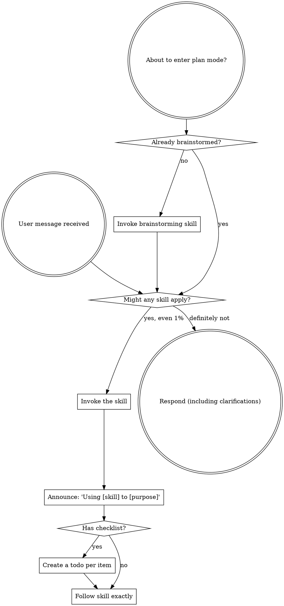

If you are a subagent dispatched to execute a specific task, you do not need to run this skill-discovery flow — focus on the task you were given.

<EXTREMELY-IMPORTANT>
If you think there is even a 1% chance a skill might apply to what you are doing, you ABSOLUTELY MUST invoke the skill. You cannot rationalize your way out of this. Follow this flow on every user message:
</EXTREMELY-IMPORTANT>

Process skills (brainstorming, systematic-debugging) decide HOW to approach a task — run them first. "Let's build X" → brainstorming. "Fix this bug" → systematic-debugging.

## Red Flags

These thoughts mean STOP—you're rationalizing:

| Thought | Reality |
|---------|---------|
| "This is just a simple question" | Questions are tasks. Check for skills. |
| "I need more context first" | Skill check comes BEFORE clarifying questions. |
| "Let me explore the codebase first" | Skills tell you HOW to explore. Check first. |
| "Let me gather information first" | Skills tell you HOW to gather information. |
| "I remember this skill" | Skills evolve. Read current version. |
| "The skill is overkill" | Simple things become complex. Use it. |
| "I'll just do this one thing first" | Check BEFORE doing anything. |

User instructions (CLAUDE.md, GEMINI.md, AGENTS.md, direct requests) take precedence over skills, which override default behavior. Instructions say WHAT, not HOW.
